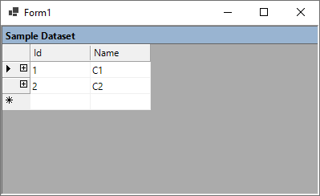
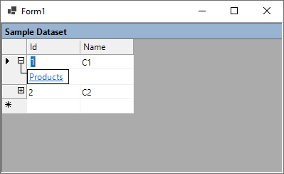
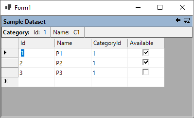

# System.Windows.Forms.DataGrid for .NET 5

This is a port of legacy Windows Forms [DataGrid](https://docs.microsoft.com/en-us/dotnet/api/system.windows.forms.datagrid?view=netframework-4.8&WT.mc_id=DT-MVP-5003235) to .NET 5. 

The `DataGrid` control is not available in .NET Core 3.1 and later versions. It's recommended you upgrade your code to use [DataGridView](https://docs.microsoft.com/en-us/dotnet/api/system.windows.forms.datagridview?view=net-5.0&WT.mc_id=DT-MVP-5003235) instead, but if case you are stuck with `DataGrid` you can use this control. 

The control has not been tested for a production environment, but as you can see in the following screenshots it works:

**Note:**  It's fully port port of the original control with the same functionalities and features. The port of run-time features is already done. Common designer features also work, however the port of designer has not finished yet.
